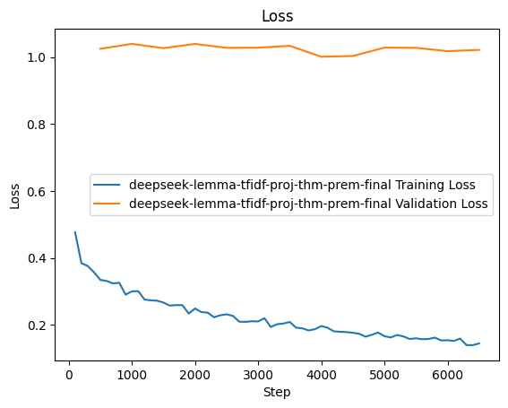

# Lemma Synthesis

## 09/04/2024

### Procedure:
Trained a model to generate helper lemmas using:
  - The current proof state. 
  - The current proof script.
  - Other lemmas in the file.
  
I mined these examples by "hiding" lemmas that were used in a proof and forcing the model to generate them.  Crucially, when I hide a lemma, I also remove it from the context so that the model can't just copy and paste it. 


### Consider the Following Proofs:
```
Theorem rev_app: forall {α : Type} (l1 l2: Test.list α),
  Test.rev l2 ++ Test.rev l1 = Test.rev (l1 ++ l2).
  intros α l1 l2.
  induction l1.
  - simpl. rewrite app_nil_r. reflexivity.
  - simpl. rewrite <- IHl1. auto. rewrite app_assoc. 
    reflexivity.
Qed.

Theorem rev_involutive: forall {α: Type} (l: Test.list α),
    Test.rev (Test.rev l) = l.
Proof.
  intros α l.
  induction l.
  - reflexivity.
  - simpl. rewrite <- rev_app. rewrite IHl. simpl. 
    reflexivity.
Qed.
```

### Synthesized Lemmas:
```
------ Lemmas in Context -----
Theorem app_assoc: forall {α : Type} (l1 l2 l3 : Test.list α ), l1 ++ l2 ++ l3 = (l1 ++ l2) ++ l3.
Theorem app_len_plus: forall {α : Type} (l1 l2: list α), len (l1 ++ l2) = len l1 + len l2.

------ State -------
α: Type
l2: Test.list α

Test.rev l2 ++ [ ] = Test.rev l2

------ Script -------
Theorem rev_app: forall {α : Type} (l1 l2: Test.list α), Test.rev l2 ++ Test.rev l1 = Test.rev (l1 ++ l2).
  intros α l1 l2.
  induction l1.
  - simpl.
  
------ Generated Lemma ------
Theorem app_len_plus: forall {α : Type} (l1 l2: list α), len (l1 ++ l2) = len l1 + len l2.

------ Target ------
Theorem app_nil_r: forall {α : Type} (l : Test.list α), l ++ [] = l.
```

```
------ Lemmas in Context -----
Theorem app_nil_r: forall {α : Type} (l : Test.list α), l ++ [] = l.
Theorem app_len_plus: forall {α : Type} (l1 l2: list α), len (l1 ++ l2) = len l1 + len l2.

------ State -------
α: Type
n: α
l1, l2: Test.list α
IHl1: Test.rev l2 ++ Test.rev l1 = Test.rev (l1 ++ l2)

Test.rev l2 ++ Test.rev l1 ++ [n] = (Test.rev l2 ++ Test.rev l1) ++ [n]

------ Script -------
Theorem rev_app: forall {α : Type} (l1 l2: Test.list α), Test.rev l2 ++ Test.rev l1 = Test.rev (l1 ++ l2).
  intros α l1 l2.
  induction l1.
  - simpl. rewrite app_nil_r. reflexivity.
  - simpl. rewrite <- IHl1. auto.
  
------ Generated Lemma ------
Theorem app_nil_r: forall {α : Type} (l : Test.list α), l ++ [] = l.

------ Target ------
Theorem app_assoc: forall {α : Type} (l1 l2 l3 : Test.list α ), l1 ++ l2 ++ l3 = (l1 ++ l2) ++ l3.
```

```
------ Lemmas in Context -----
Theorem app_nil_r: forall {α : Type} (l : Test.list α), l ++ [] = l.
Theorem app_assoc: forall {α : Type} (l1 l2 l3 : Test.list α ), l1 ++ l2 ++ l3 = (l1 ++ l2) ++ l3.
Theorem app_len_plus: forall {α : Type} (l1 l2: list α), len (l1 ++ l2) = len l1 + len l2.

------ State -------
α: Type
n: α
l: Test.list α
IHl: Test.rev (Test.rev l) = l

Test.rev (Test.rev l ++ [n]) = n :: l

------ Script -------
Theorem rev_involutive: forall {α: Type} (l: Test.list α), Test.rev (Test.rev l) = l.
Proof.
  intros α l.
  induction l.
  - reflexivity.
  - simpl.
  
------ Generated Lemma ------
Theorem app_assoc: forall {α : Type} (l1 l2 l3 : Test.list α ), l1 ++ l2 ++ l3 = (l1 ++ l2) ++ l3.

------ Target ------
Theorem rev_app: forall {α : Type} (l1 l2: Test.list α), Test.rev l2 ++ Test.rev l1 = Test.rev (l1 ++ l2).
```

### Conclusion: The model is just copying lemmas from the context.

### Problem: What if a lemma is used twice in a proof? Then we might be leaking its name to the model. 

### Training Plot:

